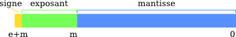

# Real Number Operations

Environment for testing bit hacks

## Numerical approximation of real numbers

Represent a real number in a computer is possible in the same way we do in maths. This is called
formal computation.

However, in many cases, dealing with numerical values is crucial. That's the purpose of integers,
where not all integers can be represented, but only a certain range.
(introducing the concept of overflow and underflow).

This is the same way for real number: computers are only capable of representing real number 
within a certain range. In addition, the set of real number is continuous. It means that, while
choosing 2 real number they can be as close as we want.

With these limitations, we will truncate the representation of real (and also rational) numbers.

So, for example `1/3 -> 0.33333333` the decimals are trunctated to a certain number.

### Fixed Point number

The 32bits integers ar represented as follow:

`00000000 00000000 00000000 00000000`

Where the left bit `0|0000000 00000000 00000000 00000000` is the sign bit.

In this case the range of representable number is: `-2 147 483 648` to `2 147 483 647`

A natural way to generalize to real number would be to set some bits as decimal numbers example:

`0|0000000 00000000 00000000.00000000`

The bits at the right of the `.` are 1/2, 1/4 etc. `2^-i`. The advantage of this notation is that
the interval between 2 consecutive numbers is fixed (in the previous case: `2^-8 = 0.00390625`)

But the drawback, will be the range: `-8 388 607.996 093 75` to `8 388 607.996 093 75`. The range
is very small for most applications. Increasing the number of bits, does not improve that much the range.

### Floating point number

Another way to represent the real numbers is to use the floating point representation.
The basis is to use the scientific representation of a number:

`800/3 ~ 233.3333333 = 0.233333E+3 (0.233333 * 10^3)`

In basis 10 we can have a number of significative digits (the decimals) and an exponent.

In the norm IEEE 754, the binary representation is:

|sign|biased exponent|mantissa|
|----|---------------|--------|
|1bit|     e bits    | m bits |

The exponent is globaly signed, but if we use the standard representation of signed integers 
(2's complement), the comparison between floats will be difficults. 
So the exponent is biased with:

`bias = 2^(e-1)-1`

In addition, some specific case for the exponent are introduced: `0` and `2^e-1`. 
In this case the numbers are 'denormalized'.

Here are the cases:

|case                |biased exponent|mantissa|
|--------------------|---------------|--------|
|Zeros               |          `0`  |    `0` |
|Denormalized numbers|          `0`  |  `!=0` |
|Normalized numbers  |  `1 <-> 2^e`  |   any  |
|Infinites           |      `2^e-1`  |    `0` |
|NaNs                |      `2^e-1`  |  `!=0` |

there can be `+Inf` and `-Inf` but also `-0` and `+0`.

In the case 32bits Float: `e=8bits` and `m=23bits`.

In the case 64bits Float: `e=11bits` and `m=52bits`.

Which can be materialized as:

`(-1)^s x 2^(exponent-bias) x 1.m`

`(-1)^[0] x 2^[10000000] x 1.[10010010000111111011011]`

`[0][10000000][10010010000111111011011]`

